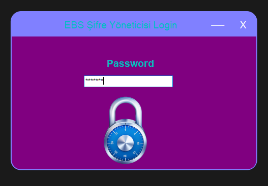
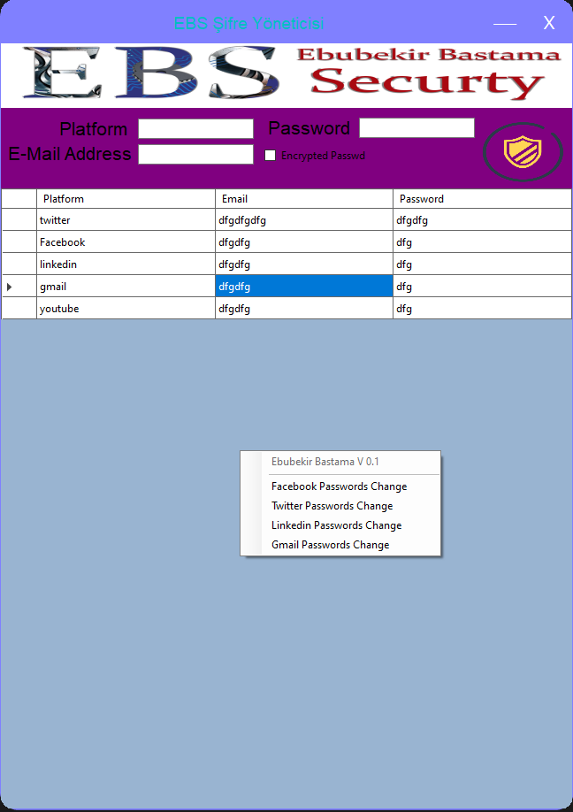

# EBS Sifre Yoneticisi
<h2>Özellikleri:</h2>
<ul>
<li>
 Kayıt edebileceğiniz bilgiler(Platform,Password,E-Mail Address)'dir.
</li>
<li>
  İlk Girişte Gireceğiniz Şifre Sayı olmak Zorundadır.
</li>
<li>
Sağ Tık Menüsü ile tek tıklama ile Facebook Sıfırlama Alanına Gidebilirsiniz.
</li>
<li>
Sağ Tık Menüsü ile tek tıklama ile <b>Twitter</b> Sıfırlama Alanına Gidebilirsiniz.
</li>
<li>
Sağ Tık Menüsü ile tek tıklama ile Linkedin Sıfırlama Alanına Gidebilirsiniz.
</li>
<li>
Sağ Tık Menüsü ile tek tıklama ile Gmail Sıfırlama Alanına Gidebilirsiniz.
</li>  
</ul>

Features continue to be added to EBS Password Manager.

---------------------------------------------------------------- ---------------

1-) Sha1 Encrypts Your Raw Password (2 Times)

2-) You can go to Facebook Password Reset area with one click.

3-) You can go to the Twitter Password Reset area with one click.

4-) You can go to Linkedin Password Reset area with one click.

5-) With one click, Gamil can go to the Password Reset area.

